# AI Engineer Roadmap 2026

> A practical roadmap for becoming an AI Engineer focused on LLMs, RAG, Agents, MCP, Evaluation, Observability, and Production AI Systems.

---

## 🌍 Languages

* 🇺🇸 English (this file)
* [🇮🇷 Persian → `README.fa.md`](fa/README.md)

---

<a href="docs/diagrams/ai-engineer-roadmap.svg">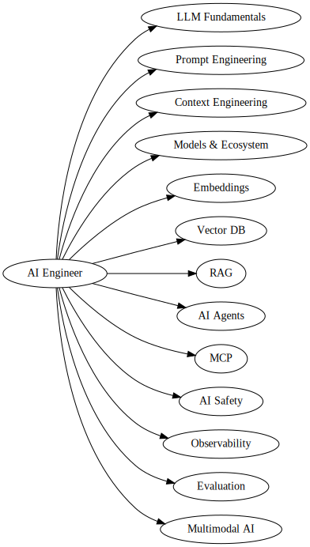</a>

---

# Why This Repository Exists

Most AI roadmaps focus heavily on theory and academic concepts.

In reality, most companies today are not training GPT-like models from scratch.

Instead, they are building:

* AI Assistants
* RAG Systems
* Enterprise Knowledge Systems
* AI Agents
* Workflow Automation
* Document Intelligence
* Multimodal Applications

This repository focuses on the skills that are actually being requested in AI Engineer job postings.

---

# AI Engineer Roadmap (Big Picture)

```text
AI Fundamentals
        │
        ▼
LLM Fundamentals
        │
        ▼
Prompt Engineering
        │
        ▼
Context Engineering
        │
        ▼
Embeddings
        │
        ▼
Vector Databases
        │
        ▼
RAG
        │
        ▼
Agents
        │
        ▼
MCP
        │
        ▼
Evaluation
        │
        ▼
Observability
        │
        ▼
Safety
        │
        ▼
Multimodal AI
        │
        ▼
Production AI Systems
```

---

# Learning Stages

## Beginner

Learn:

* AI vs AGI
* LLMs
* Tokens
* Context Windows
* Inference
* Prompt Engineering
* Embeddings

Goal:

> Understand how modern LLM applications work.

---

## Intermediate

Learn:

* Vector Databases
* Semantic Search
* RAG
* LangChain
* LlamaIndex
* Function Calling
* Context Engineering

Goal:

> Build useful AI applications using external knowledge.

---

## Advanced

Learn:

* AI Agents
* MCP
* Evaluation
* Observability
* Safety
* Multimodal Systems
* Production Architectures

Goal:

> Design and deploy enterprise-grade AI systems.

---

# What Companies Actually Need

Based on dozens of AI Engineer job postings.

| Skill                 | Demand |
| --------------------- | ------ |
| Python                | ⭐⭐⭐⭐⭐  |
| OpenAI APIs           | ⭐⭐⭐⭐⭐  |
| Prompt Engineering    | ⭐⭐⭐⭐⭐  |
| Embeddings            | ⭐⭐⭐⭐⭐  |
| Vector Databases      | ⭐⭐⭐⭐⭐  |
| RAG                   | ⭐⭐⭐⭐⭐  |
| FastAPI               | ⭐⭐⭐⭐   |
| LangChain             | ⭐⭐⭐⭐   |
| Agents                | ⭐⭐⭐⭐   |
| Docker                | ⭐⭐⭐⭐   |
| PostgreSQL            | ⭐⭐⭐    |
| LlamaIndex            | ⭐⭐⭐    |
| MCP                   | ⭐⭐     |
| Fine-Tuning           | ⭐⭐     |
| MLOps                 | ⭐⭐     |
| Training Models       | ⭐      |
| Building Transformers | ⭐      |
| AI Research           | ⭐      |

---

# AI Engineer vs Other AI Roles

| Role               | Main Focus                       |
| ------------------ | -------------------------------- |
| AI Engineer        | LLMs, RAG, Agents, Production AI |
| ML Engineer        | Training, Serving, MLOps         |
| Data Scientist     | Analytics, Prediction, Insights  |
| Research Scientist | New Models & Papers              |

---

# Knowledge Graph

```text
AI
│
├── Models
│   ├── LLM
│   ├── Closed Models
│   └── Open Models
│
├── Prompt Engineering
│
├── Context Engineering
│
├── Knowledge Systems
│   ├── Embeddings
│   ├── Vector DB
│   └── Semantic Search
│
├── RAG
│
├── Agents
│
├── MCP
│
├── Evaluation
│
├── Observability
│
├── Safety
│
└── Multimodal AI
```

---

# Core LLM Elements

| Concept             | Meaning                            |
| ------------------- | ---------------------------------- |
| Tokens              | Smallest processing units of text  |
| Context             | Model short-term memory            |
| Sampling Parameters | Output generation controls         |
| Temperature         | Randomness level                   |
| Top-K               | Select from K most likely tokens   |
| Top-P               | Select from cumulative probability |
| Repetition Penalty  | Reduce repeated outputs            |

---

# Common Terminology

| Concept             | Meaning                          |
| ------------------- | -------------------------------- |
| AI                  | Narrow intelligent systems       |
| AGI                 | Human-level general intelligence |
| LLM                 | Large Language Model             |
| Embeddings          | Semantic vector representations  |
| Training            | Model learning process           |
| Inference           | Using a trained model            |
| Vector DB           | Semantic vector storage/search   |
| AI Agent            | LLM + Tools + Decisions          |
| RAG                 | Retrieval-Augmented Generation   |
| Fine-Tuning         | Additional model training        |
| Prompt Engineering  | Designing effective prompts      |
| Context Engineering | Managing system context          |

---

# Prompt Engineering

| Concept             | Meaning                       |
| ------------------- | ----------------------------- |
| Zero-Shot           | No examples provided          |
| Few-Shot            | Learn pattern from examples   |
| CoT                 | Chain-of-Thought reasoning    |
| ReAct               | Reason + Act                  |
| Input Format        | Structured input design       |
| Function Calling    | Calling external functions    |
| Prompt Caching      | Cache static prompt sections  |
| Streaming Responses | Token-by-token output         |
| System Prompting    | Define base behavior          |
| Role & Behavior     | Assign personality            |
| Context             | Provide necessary information |
| Constraints         | Limit output behavior         |
| Structured Output   | Machine-readable output       |

---

# Context Engineering

| Concept            | Meaning                       |
| ------------------ | ----------------------------- |
| External Memory    | Persistent memory outside LLM |
| Dynamic Retrieval  | Retrieve context when needed  |
| Context Compaction | Summarize large histories     |
| Context Isolation  | Separate user contexts        |

---

# Model Types

| Concept            | Meaning                        |
| ------------------ | ------------------------------ |
| Pre-trained Models | Ready-to-use trained models    |
| Closed Models      | API-only models                |
| Open Source Models | Downloadable weights           |
| Self-Hosted Models | Run on your own infrastructure |

---

# Choosing Models

## Closed Models

| Model       | Strength                 |
| ----------- | ------------------------ |
| Claude      | Reasoning & Long Context |
| Gemini      | Multimodal Tasks         |
| GPT Series  | General Purpose          |
| O-Series    | Deep Reasoning           |
| Cohere      | Enterprise Retrieval     |
| Mistral API | Fast & Lightweight       |

---

## Open Source Models

| Model    | Strength                    |
| -------- | --------------------------- |
| Llama    | Most Popular OSS Family     |
| DeepSeek | Coding & Reasoning          |
| Qwen     | Strong Multilingual Support |
| Gemma    | Lightweight Google Models   |

---

# Platforms & Ecosystem

| Platform        | Purpose               |
| --------------- | --------------------- |
| Hugging Face    | AI ecosystem hub      |
| HF Token        | API access token      |
| HF Hub          | Models & Datasets     |
| Transformers.js | Run models in JS      |
| Ollama          | Local model execution |
| LM Studio       | GUI for local models  |
| OpenRouter      | Multi-model gateway   |

---

# APIs & SDKs

| API                    | Purpose                 |
| ---------------------- | ----------------------- |
| OpenAI Responses API   | OpenAI access           |
| Claude Messages API    | Claude access           |
| Gemini API             | Gemini access           |
| HF Inference SDK       | Hugging Face models     |
| OpenAI-Compatible APIs | OpenAI-style interfaces |

---

# Vector Databases

## Purpose

| Concept                 | Meaning              |
| ----------------------- | -------------------- |
| Semantic Search         | Search by meaning    |
| Similarity Search       | Find similar vectors |
| Nearest Neighbor Search | Closest embeddings   |

---

## Popular Vector Databases

| Database                    | Notes                      |
| --------------------------- | -------------------------- |
| Chroma                      | Simple & educational       |
| Pinecone                    | Managed service            |
| Weaviate                    | Enterprise-grade           |
| FAISS                       | Meta similarity library    |
| LanceDB                     | Local AI focused           |
| Qdrant                      | Popular open-source choice |
| Supabase Vector             | PostgreSQL + pgvector      |
| MongoDB Atlas Vector Search | Native vector search       |

---

## Vector Search Pipeline

```text
Document
    ↓
Embedding
    ↓
Vector DB
    ↓
Similarity Search
    ↓
Top-K Results
```

---

# RAG (Retrieval-Augmented Generation)

## Why RAG?

RAG allows an LLM to access knowledge that was not included during training.

Examples:

* Internal company documents
* PDFs
* Knowledge bases
* Product documentation
* Customer support systems

---

## RAG vs Fine-Tuning

| RAG                         | Fine-Tuning                 |
| --------------------------- | --------------------------- |
| Updates knowledge instantly | Requires retraining         |
| Cheaper                     | More expensive              |
| Better for documents        | Better for behavior changes |

---

## RAG Pipeline

```text
Documents
    ↓
Chunking
    ↓
Embedding
    ↓
Vector DB
    ↓
Retrieval
    ↓
Prompt
    ↓
Generation
```

---

## RAG Frameworks

| Framework  | Purpose            |
| ---------- | ------------------ |
| SDK Direct | Full control       |
| LangChain  | Agents & Workflows |
| LlamaIndex | Retrieval-first    |
| Haystack   | Search & QA        |
| RAGFlow    | Low-code RAG       |

---

# AI Agents

## Agent Concepts

| Concept          | Meaning                             |
| ---------------- | ----------------------------------- |
| Agent Use Cases  | Autonomous workflows                |
| ReAct            | Think → Act → Observe               |
| Tools            | External capabilities               |
| Function Calling | Execute actions                     |
| Multi-Agent      | Specialized agents working together |

---

## Building Agents

| Tool                    | Purpose               |
| ----------------------- | --------------------- |
| Manual Implementation   | Build from scratch    |
| OpenAI Agent SDK        | OpenAI agents         |
| OpenAI AgentKit         | Agent orchestration   |
| Claude Agent SDK        | Claude agents         |
| Vertex AI Agent Builder | Google platform       |
| Google ADK              | Agent Development Kit |

---

# MCP (Model Context Protocol)

## Core Components

| Component       | Meaning                            |
| --------------- | ---------------------------------- |
| MCP             | Standardized AI-tool communication |
| MCP Host        | Main AI application                |
| MCP Client      | Connects to servers                |
| MCP Server      | Exposes tools                      |
| Data Layer      | Shared information                 |
| Transport Layer | Communication channel              |

---

## MCP Transports

| Transport | Usage                   |
| --------- | ----------------------- |
| STDIO     | Local processes         |
| HTTP      | Web-based               |
| WebSocket | Real-time communication |

---

# AI Safety & Ethics

| Concept           | Meaning                      |
| ----------------- | ---------------------------- |
| Prompt Injection  | Override system instructions |
| Security Concerns | AI security risks            |
| Privacy Concerns  | Data leakage risks           |
| Bias              | Unfair model behavior        |
| Fairness          | Equal treatment              |

---

## Best Practices

* Prompt Hardening
* Human Review
* Audit Logging
* Rate Limiting
* User Authentication
* Data Isolation
* Tool Permission Controls
* Safety Guardrails

---

# LLM Observability

| Concept               | Meaning                  |
| --------------------- | ------------------------ |
| Tracing               | Follow execution path    |
| Logging               | Record prompts/responses |
| Cost Monitoring       | Track expenses           |
| Latency Monitoring    | Track response times     |
| Production Monitoring | System health monitoring |

---

## Observability Tools

| Tool      | Purpose                     |
| --------- | --------------------------- |
| LangSmith | LangChain debugging         |
| LangFuse  | Open-source observability   |
| Helicone  | Cost & performance tracking |
| Arize AI  | Enterprise monitoring       |

---

# LLM Evaluation

## Evaluation Types

| Type               | Purpose                   |
| ------------------ | ------------------------- |
| Deterministic Eval | Fixed expected answer     |
| Model-Based Eval   | LLM-as-a-judge            |
| Human Eval         | Human review              |
| Evaluation Metrics | Quantitative measurements |

---

## Common Metrics

| Metric             | Purpose                   |
| ------------------ | ------------------------- |
| Accuracy           | Correctness               |
| Relevance          | Relation to question      |
| Faithfulness       | Groundedness              |
| Hallucination Rate | Incorrect generation rate |
| Latency            | Response speed            |
| Cost               | Execution cost            |

---

## Evaluation Frameworks

| Framework | Purpose                  |
| --------- | ------------------------ |
| DeepEval  | LLM testing framework    |
| RAGAS     | RAG evaluation framework |

---

# Regression Testing

| Concept              | Meaning                    |
| -------------------- | -------------------------- |
| Regression Testing   | Ensure nothing breaks      |
| Golden Dataset       | Reference test set         |
| Automated Evaluation | Automatic testing          |
| Quality Baseline     | Minimum acceptable quality |

---

# Multimodal AI

## Modalities

| Type  | Meaning            |
| ----- | ------------------ |
| Text  | Language           |
| Image | Visual information |
| Audio | Sound              |
| Video | Motion + Audio     |

---

## Use Cases

| Use Case            | Purpose           |
| ------------------- | ----------------- |
| Image Understanding | Analyze images    |
| Image Generation    | Create images     |
| Video Understanding | Analyze videos    |
| Audio Processing    | Analyze sound     |
| Text-to-Speech      | Generate speech   |
| Speech-to-Text      | Transcribe speech |

---

## Multimodal APIs

| API                 | Purpose                       |
| ------------------- | ----------------------------- |
| OpenAI Vision API   | Image understanding           |
| DALL-E API          | Image generation              |
| NanoBanana API      | Image editing                 |
| Whisper API         | Speech recognition            |
| Hugging Face Models | Open-source multimodal models |

---

## Implementation Concepts

| Concept              | Meaning                      |
| -------------------- | ---------------------------- |
| Image Embeddings     | Vectorized images            |
| Audio Embeddings     | Vectorized audio             |
| Multimodal Retrieval | Search across modalities     |
| Vision Models        | Understand images            |
| Speech Models        | Process speech               |
| Multimodal RAG       | RAG over multiple modalities |
| Cross-Modal Search   | Search between modalities    |

---

# Roadmap Final Summary

| Main Column | Subjects |
|------------|------------|
| LLM Fundamentals | Tokens, Context, Sampling, Inference |
| Prompt & Context Engineering | Prompting, Context Management |
| Knowledge Systems | Embeddings, Vector DB, RAG |
| Agents & Integrations | Agents, MCP, Function Calling |
| Models & Ecosystem | GPT, Claude, Llama, HuggingFace, Ollama |
| Safety & Governance | AI Safety, Security, Privacy |
| Quality & Reliability | Evaluation, Observability, Regression Testing |
| Multimodal AI | Vision, Audio, Video, Image Generation |

---

# Visual Knowledge Graphs (AI Engineer Roadmap)

This section summarizes the entire AI Engineer roadmap visually. **(Click on images to see them bigger)**

## AI Engineer Knowledge Graph

[](docs/diagrams/AI-Engineer-Knowledge-Graph.md)

## How LLMs Actually Work

[](docs/diagrams/How-LLMs-Actually-Work.md)

## Embedding + Vector Database + RAG

[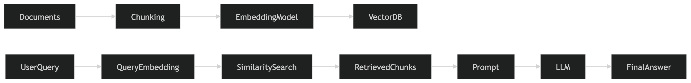](docs/diagrams/Embedding+Vector-Database+RAG.md)

## RAG vs Fine-Tuning

[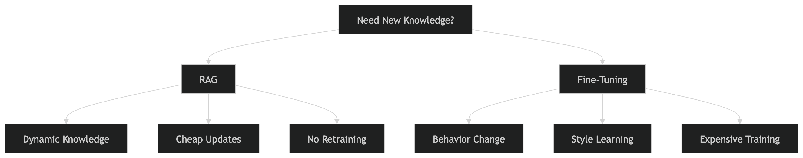](docs/diagrams/RAG-vs-Fine-Tuning.md)

## Agent Architecture

[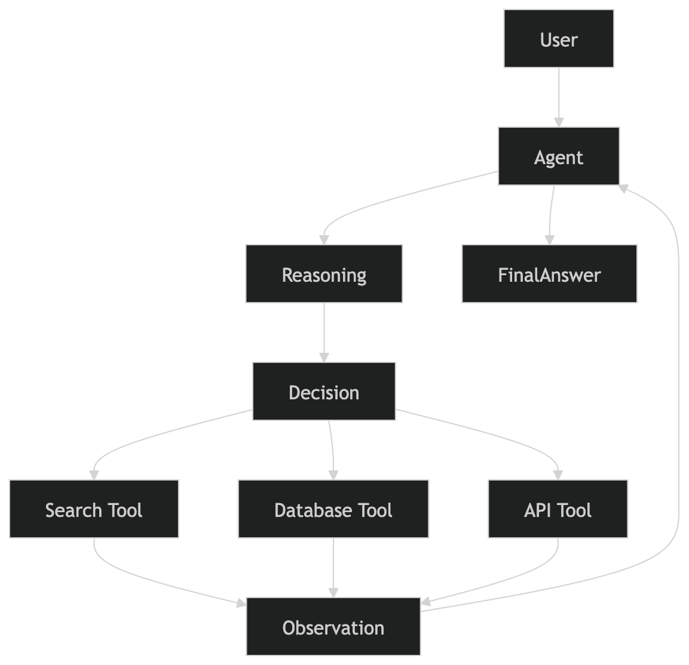](docs/diagrams/Agent-Architecture.md)

## Multi-Agent System

[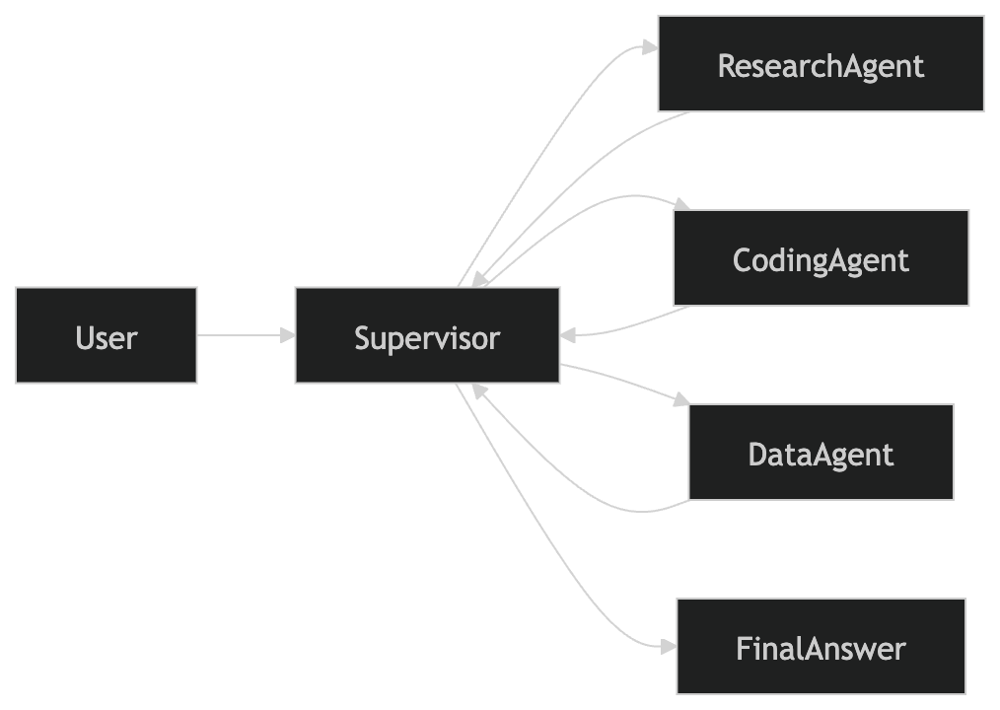](docs/diagrams/Multi-Agent-System.md)

## MCP Architecture

[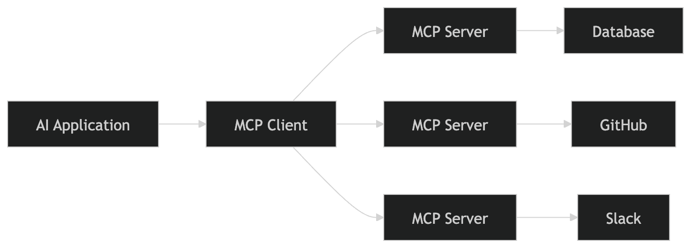](docs/diagrams/MCP-Architecture.md)

## Prompt Engineering Map

[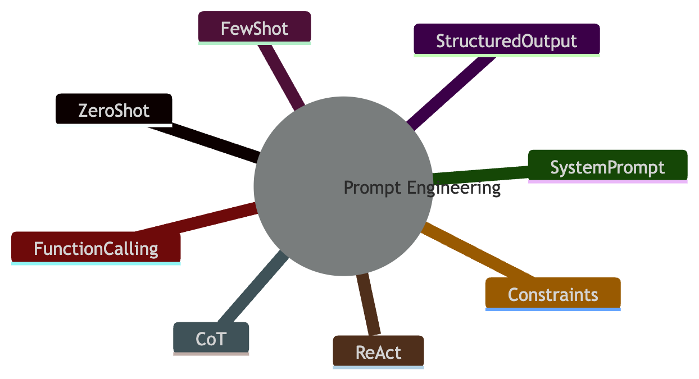](docs/diagrams/Prompt-Engineering-Map.md)

## Context Engineering Map


[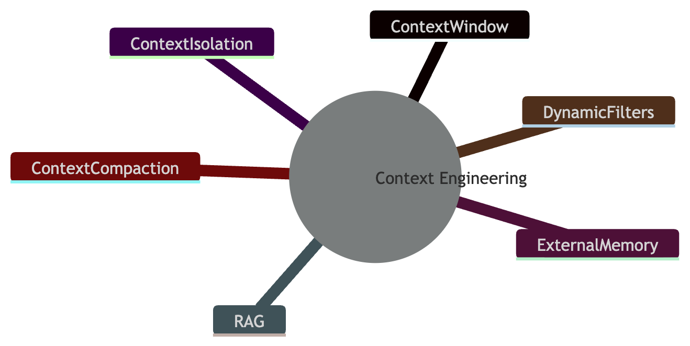](docs/diagrams/Context-Engineering-Map.md)

## AI Safety Architecture

[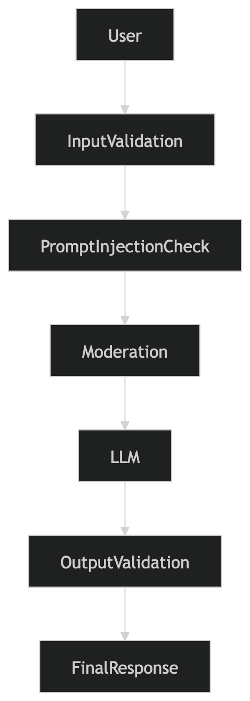](docs/diagrams/AI-Safety-Architecture.md)

## LLM Evaluation Pipeline

[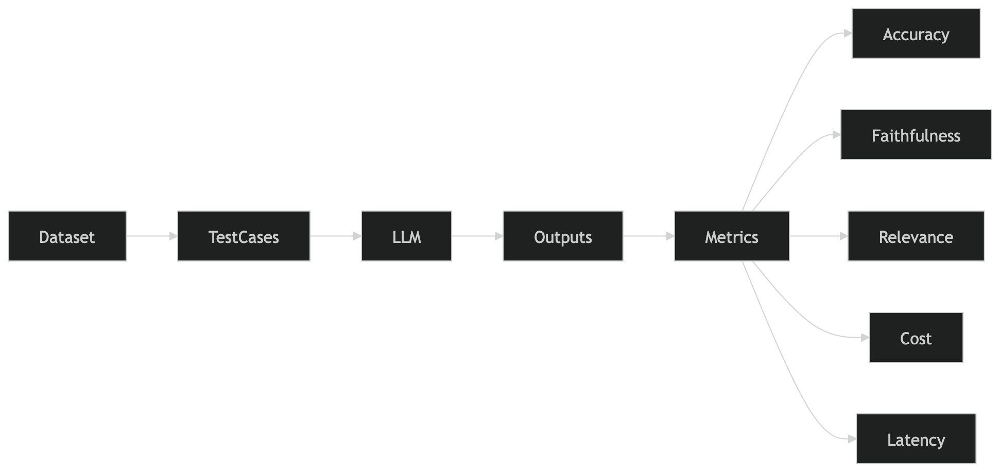](docs/diagrams/LLM-Evaluation-Pipeline.md)

## Production LLM Lifecycle

[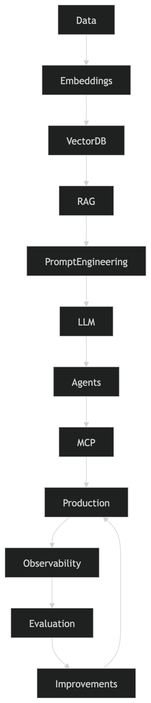](docs/diagrams/Production-LLM-Lifecycle.md)

## Complete AI Engineer Roadmap

[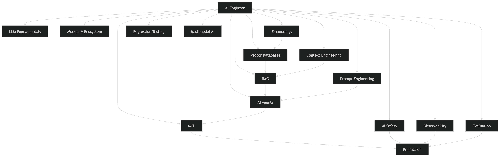](docs/diagrams/Complete-AI-Engineer-Roadmap.md)

---

# Final Advice

The majority of AI Engineer jobs today are not about training foundation models.

Instead, they focus on:

* LLM APIs
* Prompt Engineering
* Embeddings
* Vector Databases
* RAG
* Agents
* Production Systems

Master those first.

Everything else becomes significantly easier afterward.

---

⭐ If this repository helped you, consider giving it a star.
