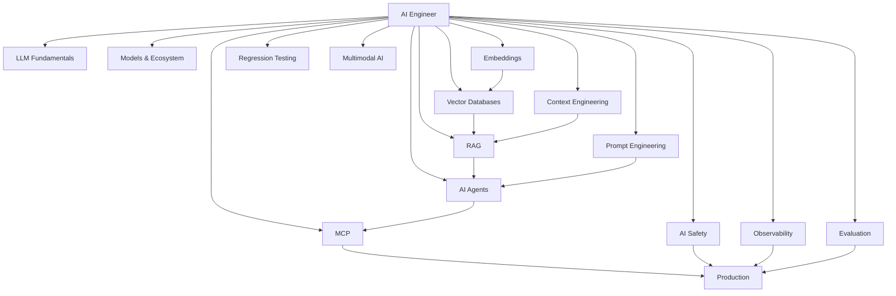

```mermaid
graph TD

A[AI Engineer]

A --> B[LLM Fundamentals]

A --> C[Prompt Engineering]

A --> D[Context Engineering]

A --> E[Models & Ecosystem]

A --> F[Embeddings]

A --> G[Vector Databases]

A --> H[RAG]

A --> I[AI Agents]

A --> J[MCP]

A --> K[AI Safety]

A --> L[Observability]

A --> M[Evaluation]

A --> N[Regression Testing]

A --> O[Multimodal AI]

H --> I

F --> G

G --> H

C --> I

D --> H

I --> J

J --> Production

K --> Production

L --> Production

M --> Production
```