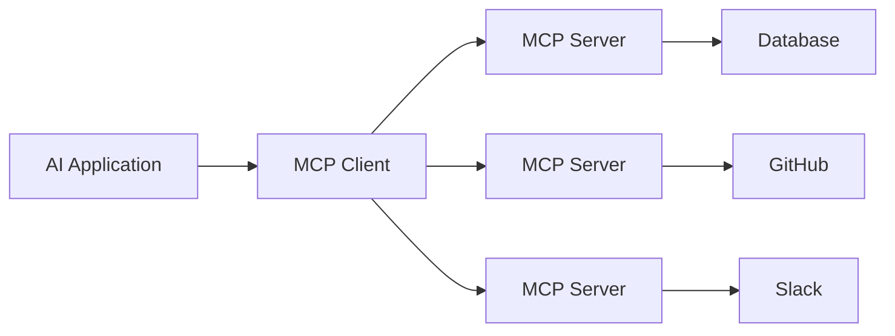

```mermaid
graph LR

Host[AI Application]

Host --> Client[MCP Client]

Client --> Server1[MCP Server]

Client --> Server2[MCP Server]

Client --> Server3[MCP Server]

Server1 --> Tool1[Database]

Server2 --> Tool2[GitHub]

Server3 --> Tool3[Slack]
```