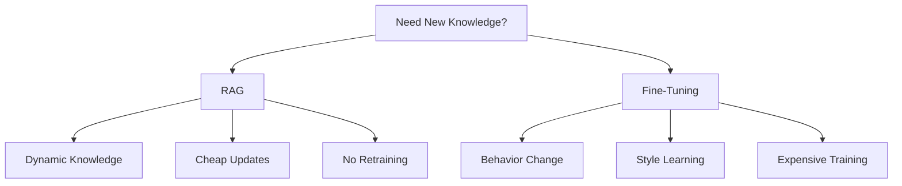

```mermaid
flowchart TD

Question[Need New Knowledge?]

Question --> RAG

Question --> FT[Fine-Tuning]

RAG --> RAG1[Dynamic Knowledge]
RAG --> RAG2[Cheap Updates]
RAG --> RAG3[No Retraining]

FT --> FT1[Behavior Change]
FT --> FT2[Style Learning]
FT --> FT3[Expensive Training]
```